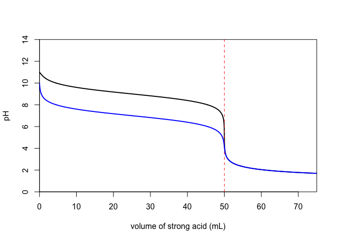
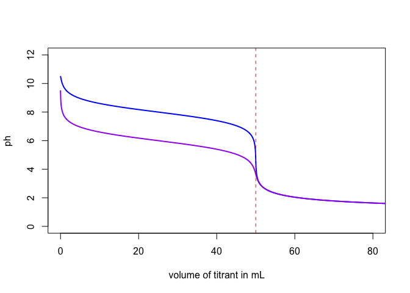
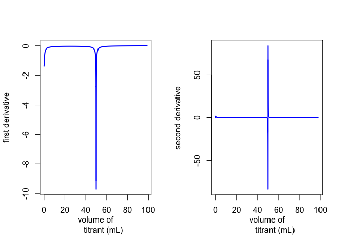
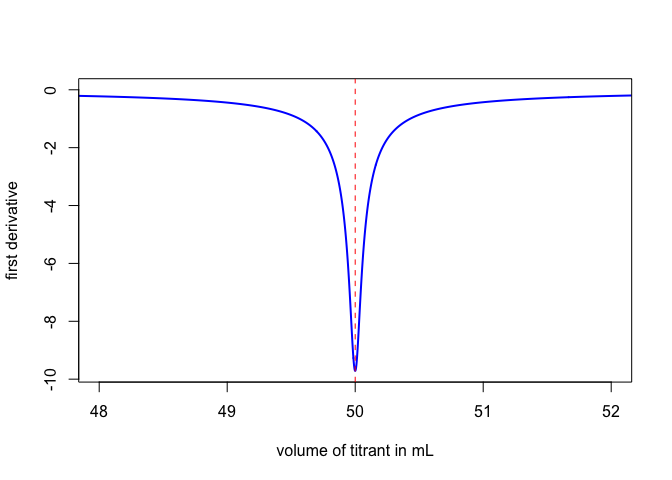

# Functions for Generating and Plotting Titration Curves

Gathered here are  functions for generating and plotting normal 
titration curves using R, including acid-base titrations, complexation
titrations, redox titrations, and precipitation titrations.

## Acid-Base Titrations

The following functions are available for the titration of acids and bases.

function | analyte(s)                           | titrant 
-------- | ------------------------------------ | ------- 
sa_sb    | monoprotic strong acid               | strong base 
sb_sa    | monoprotic strong base               | strong acid 
wa_sb    | monoprotic weak acid                 | strong base
wb_sa    | monoprotic weak base                 | strong acid
diwa_sb  | diprotic weak acid                   | strong base
diwb_sa  | diprotic weak base                   | strong acid
triwa_sb | triprotic weak acid                  | strong base
triwb_sa | triprotic weak base                  | strong acid
wamix_sb | mixture of two monoprotic weak acids | strong base
wbmix_sa | mixture of two monoprotic weak bases | strong acid

These functions  use the general approach outlined in _Principles of 
Quantitative Analysis_ by Robert de Levie (McGraw-Hill, 1997) in which 
a single master equation is used to calculate the progress of a 
titration. For example, the function `wa_sb` calculates the volume of 
strong base needed to achieve a particular pH using this equation

$$ \textrm{volume}={ V }_{ a }\times \left\{ \frac { { C }_{ a }\times \alpha -\Delta  }{ { C }_{ b }+\Delta  }  \right\} $$

where ${ V }_{ a }$ is the initial volume of the weak acid analyte, 
${ C }_{ a }$ is the initial concentration of the weak acid analyte, 
${ C }_{ b }$ is the concentration of the strong base titrant, 
$\alpha$ is the fraction of the weak acid present in its 
conjugate weak base form

$$ \alpha =\frac { { K }_{ a } }{ \left[ \textrm{ H }^{ + } \right] +{ K }_{ a } } $$

and  $\Delta$ is equal to $\left[ \textrm{ H }^{ + } \right] -\left[ \textrm{ OH }^{ - } \right]$.

The function calculates the volume of titrant over a range of pH values
that extends from a pH of 1 to a pH equal to $\textrm{p}{ K }_{ w }$. 
Because some of the calculated volumes are negative---equivalent to 
adding a strong acid to achieve a pH less than that of the original 
solution---and some of the calculate values are quite large, the function 
removes all negative volumes and all volumes greater than twice the volume of 
the titration curve's last equivalence point.

The function's arguements, all of which have default values,  are
intuitive; a representative example is shown here for the titration of
a weak base with a strong acid

```
wb_sa = function(conc.acid = 0.1, conc.base = 0.1, pka = 9, pkw = 14, 
                 vol.base = 50, eqpt = FALSE, overlay = FALSE, ...)
```

Note that the equilibrium constant(s) for a weak base are provided using
the $\textrm{p}{ K }_{ a }$ value(s) for the base's conjugate weak acid 
and that you can adjust the $\textrm{p}{ K }_{ a }$ for a solvent other
than water.

As shown below, the function produces a plot of the titration curve, with
options to overlay two or more titration curves and to add a marker
for the equivalence point. The axes are fixed to display the pH from 0 to
14 and  to display the volume of titrant from 0 to 1.5$\times$ the
titration curve's final equivalence point; you can pass along other plot 
options, such as color. 


```r
wb_sa(eqpt = TRUE)
wb_sa(pka = 7, col = "blue", overlay = TRUE)
```

 

If you assign the function to an object, then the function returns to
the object a dataframe with volumes in the first column and pH values
in the second column. You can use this object to prepare customized
plots.

```
wb1 = wb_sa(pka = 8)
wb2 = wb_sa(pka = 6)
```


```r
head(wb1)
```

```
##        volume    ph
## 1 0.006739371 10.49
## 2 0.013979345 10.48
## 3 0.021226851 10.47
## 4 0.028485659 10.46
## 5 0.035759545 10.45
## 6 0.043052291 10.44
```

```r
plot(wb1, ylim = c(0,12), xlim = c(0,80), type = "l", col = "blue",
     lwd = 2, xlab = "volume of titrant in mL")
lines(wb2, col = "purple", lwd = 2)
abline(v = 50, col = "red", lty = 2)
```

 

Finally, the function `derivative` accepts an object created by one of
the titration functions and returns a plot of the titration curve's first
and second derivatives along with a data frame that contains the values used
to prepare the two titration curves.


```r
wb1.d = derivative(wb1)
```

 

```r
str(wb1.d)
```

```
## List of 2
##  $ first_deriv :'data.frame':	901 obs. of  2 variables:
##   ..$ x1: num [1:901] 0.0104 0.0176 0.0249 0.0321 0.0394 ...
##   ..$ y1: num [1:901] -1.38 -1.38 -1.38 -1.37 -1.37 ...
##  $ second_deriv:'data.frame':	900 obs. of  2 variables:
##   ..$ x2: num [1:900] 0.014 0.0212 0.0285 0.0358 0.0431 ...
##   ..$ y2: num [1:900] 0.198 0.296 0.393 0.488 0.581 ...
```

```r
plot(wb1.d$first_deriv, xlim = c(48,52), col = "blue", type = "l", lwd = 2,
     xlab = "volume of titrant in mL", ylab = "first derivative")
abline(v = 50, col = "red", lty = 2)
```

 

## Complexation Titrations

coming soon...

## Redox Titrations

coming soon...

## Precipitation Titrations

coming soon...


